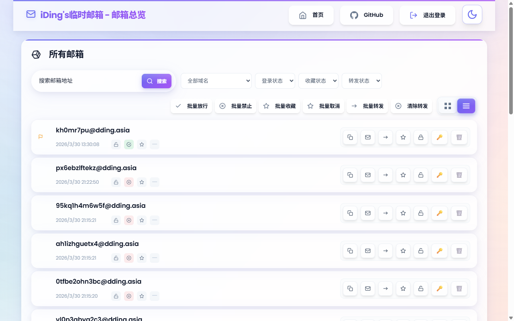

# Freemail - 临时邮箱服务

[](https://deploy.workers.cloudflare.com/?url=https://github.com/wenfxl/freemail)

一个基于 Cloudflare Workers + D1 构建的**开源临时邮箱服务**，支持邮件接收、发送、转发、用户管理等完整功能。

**当前版本：V5.1.1** - 邮箱别名规范化支持扩展，支持 `.` `+` `-` 三种分隔符切分

`转发的地址需要在cloudflare Email Addresses中验证`

📖 **[一键部署指南](docs/yijianbushu.md)** | 📬 **[Resend 发件配置](docs/resend.md)** | 📚 **[API 文档](docs/api.md)**

## 📸 项目展示
### 体验地址： https://mailexhibit.dinging.top/

### 体验账号： guest
### 体验密码： guest
### 页面展示

#### 首页


#### 所有邮箱


#### 用户管理


#### 单个邮箱登录


#### [浅色模式展示](docs/zhanshi-light.md) | [深色模式展示](docs/zhanshi-dark.md)

## 功能特性

| 类别 | 特性 |
|------|------|
| 📧 **邮箱管理** | 随机生成临时邮箱 · 多域名支持 · 置顶/收藏 · 历史记录 · 邮箱搜索 |
| 💌 **邮件功能** | 实时接收 · 自动刷新 · 验证码智能提取 · HTML/纯文本 · 邮件转发 |
| ✉️ **发件支持** | Resend API 集成 · 多域名密钥 · 批量发送 · 定时发送 · 发件记录 |
| 👥 **用户管理** | 三层权限模型 · 用户/邮箱分配 · 邮箱单点登录 · 登录权限控制 |
| 🎨 **现代界面** | 毛玻璃效果 · 响应式设计 · 移动端适配 · 列表/卡片视图 |
| ⚡ **技术架构** | Cloudflare Workers · D1 数据库 · Email Routing |

> 💡 邮箱用户自行修改密码功能默认关闭，如需开启请将 `mailbox.html` 第 77-80 行取消注释。

## 版本历史

| 版本 | 主要更新 |
|------|----------|
| **V5.1.1** | 邮箱别名规范化支持扩展 · 支持 `.` `+` `-` 三种分隔符切分 |
| **V5.1** | 邮箱别名规范化支持 · xx.abc@ex.co 邮件会收到 abc@ex.co |
| **V5.0** | 全新 UI · SVG 图标 · 深色模式 · 管理面板统计与布局优化 |
| **V4.8** | 单个邮箱转发 · 收藏功能 · 按状态筛选 |
| **V4.5** | 多域名 Resend 密钥配置 |
| **V4.0** | 邮箱地址单点登录 · 全局邮箱管理 · 邮箱搜索 |
| **V3.5** | 数据库优化 · 邮件正文持久化 · 移动端适配 |
| **V3.0** | 三层权限模型 · 用户管理后台 |
| **V2.0** | Resend 发件集成 · 邮箱置顶 |
| **V1.0** | 邮箱生成 · 邮件接收 · 验证码提取 |

## 部署配置

### 快速开始

1. **一键部署**：点击顶部按钮，按照 [部署指南](docs/yijianbushu.md) 完成配置
2. **配置邮件路由**（收件必需）：域名 → Email Routing → Catch-all → 绑定 Worker
3. **配置发件**（可选）：参考 [Resend 配置教程](docs/resend.md)

> 使用 Git 集成部署时，请在 Workers → Settings → Variables 中手动配置环境变量

### 环境变量

| 变量名 | 说明 | 必需 |
|--------|------|------|
| TEMP_MAIL_DB | D1 数据库绑定 | 是 |
| MAIL_DOMAIN | 邮箱域名，多个用逗号分隔 | 是 |
| ADMIN_PASSWORD | 严格管理员密码 | 是 |
| ADMIN_NAME | 严格管理员用户名（默认 `admin`） | 否 |
| JWT_TOKEN | JWT 签名密钥 | 是 |
| RESEND_API_KEY | Resend 发件密钥，支持多域名配置 | 否 |
| EMAIL_WEBHOOK_URL | 收信后转发到外部 API 的基础地址，例如 `https://your-domain.com`；需要你填的EMAIL_WEBHOOK_URL有公网访问 | 否 |
| EMAIL_WEBHOOK_SECRET | 收信 Webhook 鉴权密钥，需与后端保持一致 | 否 |
| EMAIL_WEBHOOK_TIMEOUT_MS | 收信 Webhook 请求超时（毫秒，默认 `10000`） | 否 |
| FORWARD_RULES | 邮件转发规则 | 否 |

<details>
<summary><strong>RESEND_API_KEY 配置格式</strong></summary>

```bash
# 单密钥（向后兼容）
RESEND_API_KEY="re_xxxxxxxxxxxxxxxxxxxxxxxx"

# 键值对格式（推荐）
RESEND_API_KEY="domain1.com=re_key1,domain2.com=re_key2"

# JSON格式
RESEND_API_KEY='{"domain1.com":"re_key1","domain2.com":"re_key2"}'
```

系统会根据发件人域名自动选择对应的 API 密钥。
</details>

<details>
<summary><strong>EMAIL_WEBHOOK_* 配置说明</strong></summary>

当且仅当 `EMAIL_WEBHOOK_URL` 和 `EMAIL_WEBHOOK_SECRET` 同时非空时，Freemail 会启用 **Webhook 收信模式**：

- 收到邮件后，直接转发到你的后端 API
- **不再写入 D1**
- 适合将邮件交给你自己的服务做解析、提取验证码、存 Redis/数据库

如果任意一个未配置，则保持原有 **D1 入库模式**。

### 部署后如何配置

如果你是通过顶部 **Deploy to Cloudflare Workers** 按钮一键部署，通常需要在部署完成后手动进入：

`Workers & Pages` → 你的 Worker → `Settings` → `Variables`

添加以下环境变量：

```bash
EMAIL_WEBHOOK_URL="https://your-domain.com/api/webhook/email"
EMAIL_WEBHOOK_SECRET="your-secret"
EMAIL_WEBHOOK_TIMEOUT_MS="10000"
```

### Webhook 请求格式

请求示例：

```http
POST /api/webhook/email
X-Webhook-Secret: your-secret
Content-Type: application/json
```

请求体：

```json
{
  "message_id": "<example-message-id@example.com>",
  "to_addr": "target@example.com",
  "raw_content": "完整 RFC822 原始邮件内容"
}
```

### 字段说明

- `message_id`：优先取邮件头 `Message-ID`，取不到时自动生成
- `to_addr`：会先做别名归一化，再传给你的后端
- `raw_content`：优先传原始邮件；若是 HTTP `/receive` 接口且上游未提供 `raw_content`，系统会根据 `to/from/subject/text/html` 自动拼出一份 RFC822 格式内容
- `EMAIL_WEBHOOK_TIMEOUT_MS`：Webhook 请求超时，单位毫秒，默认 `10000`

</details>

<details>
<summary><strong>FORWARD_RULES 配置格式</strong></summary>

规则按前缀匹配，`*` 为兜底规则。

⚠️ **重要**：转发目标邮箱必须在 Cloudflare 控制台中验证后才能使用：
1. 进入 Cloudflare 控制台 → 域名 → 电子邮件 → 电子邮件路由
2. 切换到「目标地址」选项卡
3. 点击「添加目标地址」，输入转发目标邮箱
4. 前往目标邮箱收取验证邮件并点击确认链接


```bash
# 键值对格式
FORWARD_RULES="vip=a@example.com,news=b@example.com,*=fallback@example.com"

# JSON格式
FORWARD_RULES='[{"prefix":"vip","email":"a@example.com"},{"prefix":"*","email":"fallback@example.com"}]'

# 禁用转发
FORWARD_RULES="" 或 "disabled" 或 "none"
```
</details>

## 故障排除

<details>
<summary><strong>常见问题</strong></summary>

1. **邮件接收不到**：检查 Email Routing 配置、MX 记录、MAIL_DOMAIN 变量
2. **数据库连接错误**：确认 D1 绑定名为 `TEMP_MAIL_DB`，检查 database_id
3. **登录问题**：确认 ADMIN_PASSWORD 和 JWT_TOKEN 已设置，清除浏览器缓存
4. **界面显示异常**：检查静态资源路径，查看浏览器控制台错误
</details>

<details>
<summary><strong>调试技巧</strong></summary>

```bash
# 本地调试
wrangler dev

# 查看实时日志
wrangler tail

# 检查数据库
wrangler d1 execute TEMP_MAIL_DB --command "SELECT * FROM mailboxes LIMIT 10"
```
</details>

## 注意事项

- **静态资源缓存**：更新后在 Cloudflare 控制台 Purge Everything，浏览器强制刷新
- **D1 费用**：有免费额度限制，建议定期清理过期邮件
- **安全**：生产环境务必修改默认的 `ADMIN_PASSWORD` 和 `JWT_TOKEN`

## Star History

[](https://www.star-history.com/#idinging/freemail&Date)

## 许可证

Apache-2.0 license
